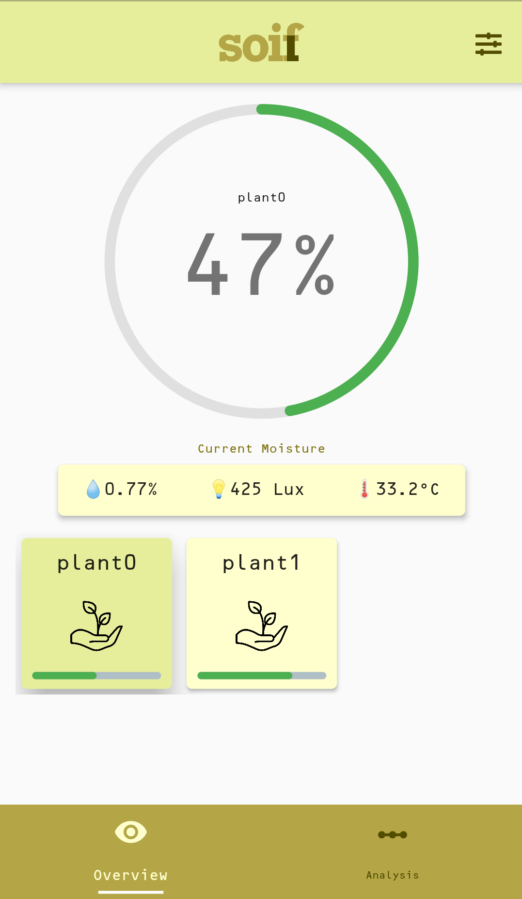
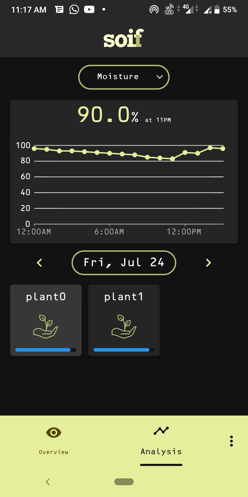
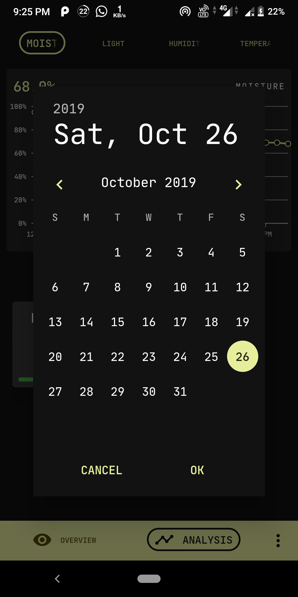
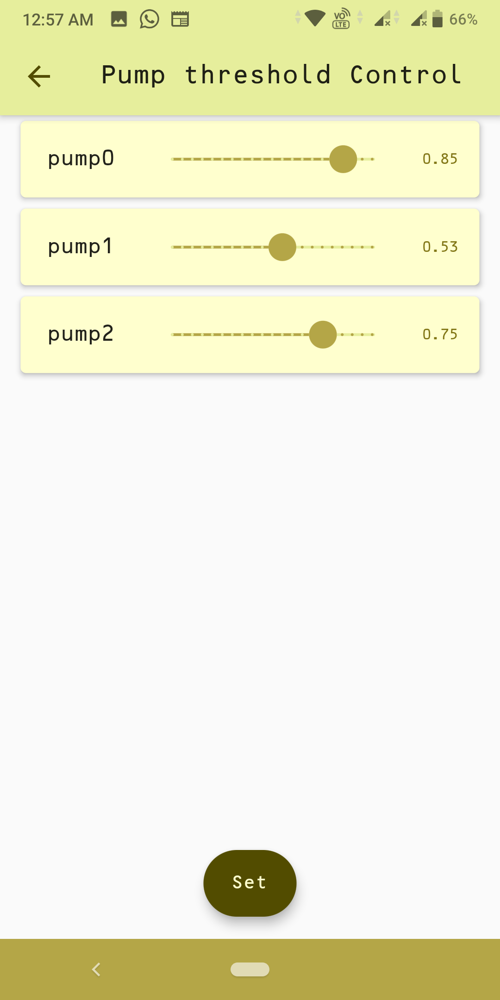

# 

[](https://github.com/RoyARG02/soil_moisture_app/releases) [](https://www.codacy.com/manual/RoyARG02/soil_moisture_app?utm_source=github.com&amp;utm_medium=referral&amp;utm_content=RoyARG02/soil_moisture_app&amp;utm_campaign=Badge_Grade) [](https://opensource.org/licenses/GPL-3.0)  

This is a Flutter project, which will serve as the dashboard for the **Soil Moisture** content of a particular area.

Color Theme: [Material.io](https://material.io/resources/color/#!/?view.left=0&view.right=0&primary.color=E6EE9C&secondary.color=827717)

Font: [OCRB](https://github.com/opensourcedesign/fonts/tree/master/OCR)

### Screenshots

<p align = "middle">
  
  
  <br><br>
  
  
</p>

### Description

The app gets its name from the _French word_ for `Thirst`. Its purpose, is to detect moisture content of soil from sensors.

Moisture was the main motif, but later it rolled to collecting ambient temperature, humidity and light too.

### API endpoints and repository

The API implementation of this project can be found [in this repository](https://github.com/forkbomb-666/drip_irrigation_server).

The base URL for the application is `https://soif.herokuapp.com/`

The various endpoints used by this app are:

- ```/getdata/<currentdate in dd-mm-yyyy>```
- ```/getdata/now```
- ```/setpump```
- ```/getpump```

### Contributions

We would love to see some feedback in the form of issues raised and PRs. If you need an **IoT** project with application integration, this project can serve as the baseline application. Show your appreciation by :star:ing this repository!​ ​

### Team Members

- Anurag Roy - [Github](https://github.com/RoyARG02) [Twitter](https://twitter.com/_royarg)
- Ayush Thakur - [Github](https://github.com/ayulockin) [Twitter](https://twitter.com/ayushthakur0)
- Snehangshu Bhattacharya - [Github](https://github.com/forkbomb-666) [Twitter](https://twitter.com/snehangshu_)
- Aritra Roy Gosthipaty - [Github](https://github.com/ariG23498) [Twitter](https://twitter.com/ariG23498)
