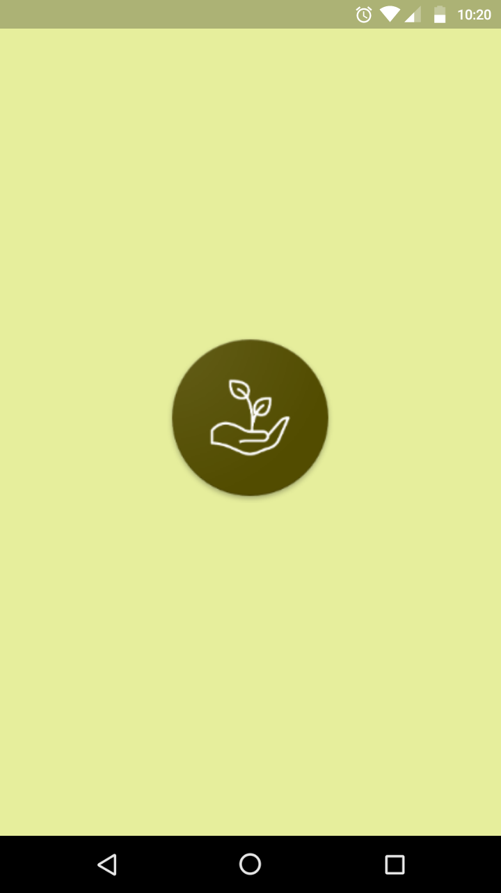
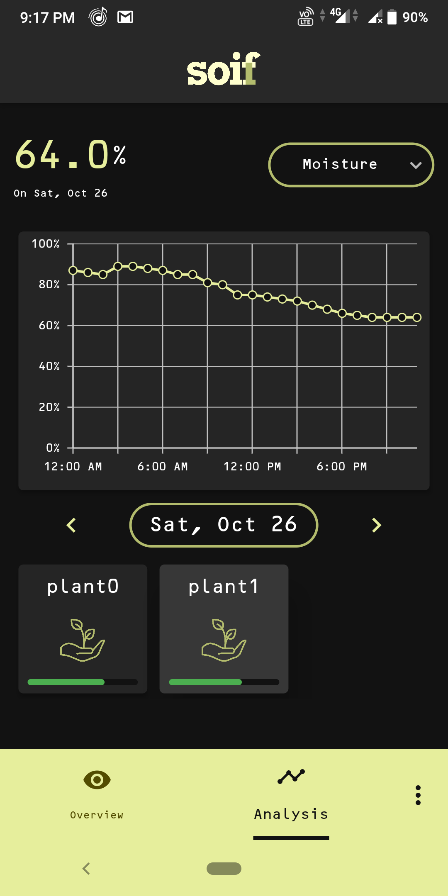
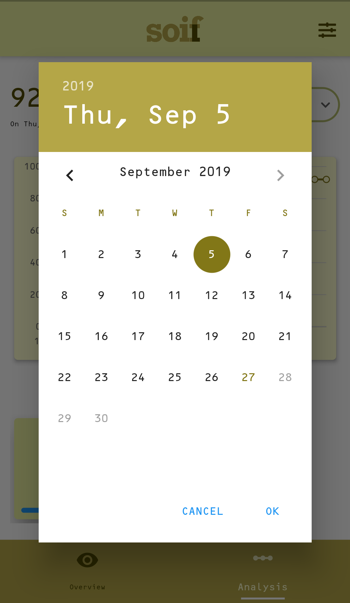

# SOIF

This is a Flutter project, which will serve as the dashboard for the `Soil Moisture` content of a particular area.

Color Theme: [Material.io](https://material.io/resources/color/#!/?view.left=0&view.right=0&primary.color=E6EE9C&secondary.color=827717)

### Screenshots

|

|

|

### Description

The app gets its name from the _French word_ for `Thirst`. Its purpose, is to detect moisture content of soil from sensors.

Moisture was the main motif, but later it rolled to collecting ambient temperature, humidity and light too.

### API endpoints

The base URL for the application is `https://drip-io.herokuapp.com/`

The various endpoints are:

- ```/getdata/<currentdate in dd-mm-yyyy>```

- ```/getdata/now```

- ```/setthreshold```

- ```/getthreshold```

### Contributions:

We would love to see some feedback in the form of issues raised and PRs. If you need an `IoT` project with application integration, this project can serve as the baseline application. Show your appreciation by :star: ing and this repository.​ ​

### Team Members:

* Anurag Roy - [Github](https://github.com/RoyARG02) [Twitter](https://twitter.com/_royarg)
* Ayush Thakur - [Github](https://github.com/ayulockin) [Twitter](https://twitter.com/ayushthakur0)
* Snehangshu Bhattacharya - [Github](https://github.com/forkbomb-666) [Twitter](https://twitter.com/JohnDoe68522490)
* Aritra Roy Gosthipaty - [Github](https://github.com/ariG23498) [Twitter](https://twitter.com/ariG23498)

